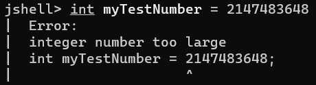

## <font color="#99FF99">Introduction to Java</font>  

Java
: Java is a powerful and versatile programming language that has been widely used for over two decades. It's known for its portability, security, and object-oriented approach.  

### <font color="#99FF99">Key features of Java</font>
- General-Purpose Programming Language
- Easy to learn 
- Write Once, Run Anywhere (WORA)
- Object-Oriented
- Secure
- Platform Independent
- It's Free!  

### <font color="#99FF99">Characteristics of Java</font>
- Uses C/C++ basic syntax and basic data types - int, char, float, double, long, short, byte etc.
- Uses standard C/C++ control structures
- “Pure” OO(Object Oriented) language
- No stand alone functions -All code is part of a class
- No explicit pointers - uses references
- Uses garbage collection
- Java is strongly typed
- Java is normally compiled to a bytecode.
- Java bytecode is a machine language for an abstract 
machine
- Makes Java secure and Portable
- Each platform (or browser) that runs Java has a Java 
Virtual Machine (JVM) . The JVM executes Java bytecodes


## <font color="#99FF99">Requirments to code in Java?</font>
We need a few things to get started.  
- JDK (Java Development Kit)
- An IDE or a Code/Text Editor  

Yep, that's all you need. ✅  

For this guide I'll be using the [Intellij IDEA](https://www.jetbrains.com/idea/download/?section=windows) IDE by JetBrains. But you can use any IDE or Code/Text editor. Some notable ones are [Eclipse](https://www.eclipse.org/downloads/), [NetBeans](https://netbeans.apache.org/front/main/download/index.html) and [Visual Studio Code](https://code.visualstudio.com/).

Now let's write our first code in Java!  

## <font color="#99FF99">Writing our first code</font>
Whenever we learn a new programming language, it has become a tradition that we start our journey by printing "Hello world". We'll be doing exactly that right now.  

```java

public class HelloWorld {
    public static void main(String[] args) {
        System.out.print("Hello world");
    }
}
```

**Here's a breakdown of each part of the code:**

**1. `public class HelloWorld`**

- **`public`:** This keyword means the class is accessible from anywhere in your program. It's like opening the door to the class for other parts of your code to use it.
- **`class`:** This keyword declares a new class, which is a blueprint for creating objects. It's like a template for building things.
- **`HelloWorld`:** This is the name you've given to the class. It's like giving a name to the blueprint.

**2. `public static void main(String[] args)`**

- **`public`:** Same as before, this means the method is accessible from anywhere.
- **`static`:** This means you can call this method without creating an object of the `HelloWorld` class. It's like having a tool that you can use directly without needing to build a whole machine first.
- **`void`:** This means the method doesn't return any value. It just does its job and then finishes.
- **`main`:** This is the special method that Java looks for to start your program. It's like the ignition switch that gets things going. It's the same as you've seen in C.
- **`(String[] args)`:** This part allows you to pass arguments (extra information) to the program when you run it. It's like giving instructions to the program before it starts. **`String[]`** is basically the name of the pre-defined class here. And **`args`** is the name of the string. You can name it anything you want.

 > Variable names must start with a letter, underscore (_), or dollar sign ($). Can contain nothing except letters, digits, underscores, and dollar signs
 and it cannot be a reserved keyword.
{: .prompt-warning }  

**3. `System.out.print("Hello world");`**

- **`System.out.print`:** This part tells Java to print something to the console (the text window where you see the output). It's like using a loudspeaker to speak to the user.
- **`"Hello world"`:** This is the text that you want to print to the console. It's the message you're sending to the user.

**In essence:**

- You're creating a class named `HelloWorld` that acts as a blueprint for your program.
- Inside that class, you have a method named `main` that Java runs when the program starts.
- The `main` method simply prints the message "Hello world" to the console to show that the program ran successfully.

**Congratulations!** 🥳 You've wrote your first Java program!  


## <font color="#99FF99">Terms we need to be clear about</font>  

### <font color="#99FF99">Keyword</font>
A keyword is any one of the reserved words, that have a predefined meaning in Java.  


In Java syntax, **all code is case-sensitive**, and this includes keywords. As we'll soon see, an **int**, all in lowercase, is not the same as **Int**, with a capital **I**. Here, an **int**,(all in lowercase) is a keyword in Java.  

Here is a list of keywords in the Java programming language. You cannot use any of the following as identifiers in your programs. The keywords const and goto are reserved, even though they are not currently used. `true`, `false`, and `null` might seem like keywords, but they are actually literals; you cannot use them as identifiers in your programs.

| Keywords in Java |               |             |
|    -----------   | ------------- | ----------- |
| abstract         | synchronized  | return
| continue         | this          | short
| for              | protected     | transient
| new              | throw         | try
| switch           | public        | void
| assert           | throws        | volatile
| default	       | goto	       | package
| boolean	       | do	if	       | private
| break	           | double	       | implements	
| byte	           | else	       | import
| case	           | enum	       | instanceof		
| catch	           | extends	   | int
| char	           | final	       | interface
| class	           | finally	   | long
| const*	       | float	       | native	
| while            | super	       | strictfp
| static	

### <font color="#99FF99">Variables</font>
Variables are **a way to store information in our computer**.

Variables that we define in a program, can be accessed **by a name we give them**, and the computer does the hard work of figuring out where they get stored in the computer's **Random Access Memory(RAM)**.

To create a variable, first we need to know about **Data Types**.  

#### Data Type
There are lots of **different types of data, that we can define for our variables**. Collectively, these are known as data types.

As you may have guessed, **some data types are keywords** in Java.  When we get to the Object Oriented features of Java, you will see that we have a lot of flexibility for creating our own data types, but for now, we'll explore **primitive data types**, which are **built into the Java language**.  

#### Define a variable
Now that we've understood what Data Types are, we may create a variable. To define a variable:
1. We need to specify the **data type**
2. Then, give our variable a **name**
3. ***Optionally***, <font color="#FFCC99">add an <b>expression</b> to initialize the variable with a value.</font>

```java

int myFirstNumber = 5;
```
We have just declared a variable of type `int` named `myFirstNumber` and assigned value `5` to our variable.

> Note that, we can assign a value to a variable multiple times in Java, but it’s the declaration (which includes the data type) that cannot normally be done a second time for the same variable.
{: .prompt-info }  

### <font color="#99FF99">Operators</font>
Operator
: Java operators, or just operators, perform an operation (hence the term) on a variable or value.  

Addition(`+`), Subtraction(`-`), Division(`/`), and Multiplication(`*`) are four common ones that I feel sure you're familiar with, but there are lots more operators you will work with later on.  

### <font color="#99FF99">Expressions</font>
Expression
: The expression is the code segment that is on the right side of the equals sign in an assignment or declaration statement.  

This code can be a simple literal value, like the number 5, or it can be a complex mathematical equation using multiple literal values and mathematical operators.  

### <font color="#99FF99">String Literals</font>

Text specified in double-quotes is called "string literals".

> Double quotes `(" ")`are used for string literals and single quotes`(' ')`are used for character literals.
{: .prompt-info }  

### Class
A class is a building block for object-oriented programming, and allows us to **build custom data types**.

### Wrapper Class
Java uses the concept of a wrapper class, for all of its eight primitive data types.

A wrapper class provides simple operations, as well as some basic information about the primitive data type, which cannot be stored on the primitive itself. 

MIN_VALUE, and MAX_VALUE, are elements of this basic information, for the int data type.  

### Overflow and Underflow in Java
If you try and put a value larger than the maximum value into an int, you'll create something called an Overflow situation.  

And similarly, if you try to put a value smaller than the minimum value into an int, you cause an Underflow to occur.  

These situations are also known as **integer wraparounds**.
<br/>  
<font color = "#FFCC99">The maximum value, when it overflows, wraps around to the minimum value, and just continues processing without an error.

The minimum value, when it underflows, wraps around to the maximum value, and continues processing.</font>

This is not usually behavior you really want, and as a developer, you need to be aware that this can happen, and choose the appropriate data type.

#### When will we get an overflow? when will you get an error?
An integer wraparound event, either an overflow or underflow, can occur in Java when you are using expressions that are not a simple literal value. 

The Java compiler doesn't attempt to evaluate the expression to determine its value, so it DOES NOT give you an error.

<font color = "#FFCC99">*Now look at these example below carefully*</font>

Here are two more examples that will compile, and result in an overflow.  The second example may be surprising.  Even though we are using numeric literals in the expression, the compiler still won't try to evaluate this expression, and the code will compile, resulting in an overflow condition.

```java
int thisWillCompile = (Integer.MAX_VALUE + 1);
int thisWillCompile = (2147483647 + 1);
```
**BUT** if you assign a numeric literal value to a data type that is outside of the range, the compiler DOES give you an error.




> You can use underscores (`_`) to improve integer readablity.  
*Example:* `int a = 2_147_483_647;`  
Which will give you `a ==> 2147483647`
{: .prompt-tip }

## <font color="#99FF99">Before we start</font>  

Before we start our journey of Java, it's crusial to know certain things about it. Below are the things we need to understand to code on Java.  

### <font color="#99FF99">Java Code is case sensitive</font>
Java code is case sensitive.  

**This includes not only keywords and language syntax, but variable names and data types as well.**  

`myFirstNumber` is not the same variable as `MyFirstNumber` with a capital M.  

**int** in lowercase, is not the same as **Int** with the first letter capitalized, or **INT**, all in uppercase, etc.  

**Keywords need to be in lowercase.**  

And **variables will always be exactly as you declare them, including capitalization.**  

<font color="#FFCC99"><i>Remember that, case matters in Java code!</i></font>  


### <font color="#99FF99">How to name a java source file?</font>
- All java source file should end with .java  
    - <font color="#FFCC99"><i>Example : </i></font>`Hello.java`  

- Each `.java` file can contain only **one public class**.

- The name of the file should be the name of the public class plus ".java"  
    - <font color="#FFCC99"><i>Example : </i></font>If the public class is `public class HelloWorld` (HelloWorld), then the file name should be `HelloWorld.java`  

> As convention, if the class name contains multiple words then capitalize the first letter of each word.  
<i>Example:</i> `HelloWorld.java`
{: .prompt-info }  

### <font color="#99FF99">Java's Primitive Types</font>

In Java, Primitive Types are the most basic data types.  

The **eight** primitive data types in Java are shown in the tables below, listed by the type of data stored for each:

| Whole Number | Real number (floating point or decimal)|
| ------------ | --------------------------------------|  
|byte          | float                                 |
|short         | double                                |
|int           |
|int           |
|long          | 

|Single Character| Boolean Value |
|----------------| ------------- |       
| char           | boolean       |  

Consider these types as the building blocks of data manipulation.  

<font color="#FFCC99">Remember that primitive data types are simply placeholders in memory for a value.
</font>


### Data Range

#### Integer
There's a specified range of values allowed for the int, which is true for most data types.  

What this means is, that the allowable range of values is NOT infinite.

There's a defined minimum, and maximum value, for each numeric data type, meaning you can't assign a number bigger or smaller (outside of that range).

##### Finding out the range of integer type
If we want to view the minimum value and the maximum value of an integer type data respectively, we can run the following code:

```java
public class Main {
    public static void main(String[] args) {

        int minIntValue = Integer.MIN_VALUE;
        int maxIntValue = Integer.MAX_VALUE;

        System.out.println("Minimun value of int data type = " + minIntValue);
        System.out.println("Maximum value of int data type = " + maxIntValue);
    }
}
```

The outputs will be as below:
```java
Minimun value of int data type = -2147483648
Maximum value of int data type = 2147483647
```
As we can see, the integer data type can hold a value from the range of -2147483648 to 2147483647.

##### Using the `+` sign with System.out.ptint
The plus sign, +,  when used in `System.out.print` will print different data types together as a single line of text.  

In the example above:

We want to print a label, before a numeric integer value. Whatever follows the plus sign in `System.out.print` here, is converted to a String by Java, and concatenated to the String before it.  

This is perfectly valid syntax in Java.

**Challenge :**
Try to find the output of this code segment below:
```java
public class HelloWorld {
    public static void main(String[] args) {

        System.out.println("Integer value range (" + Integer.MIN_VALUE + " to " + Integer.MAX_VALUE + ")");
    }
}
```

The output should be : `Integer value range (-2147483648 to 2147483647)`  

##### Casting in java


> You can leave a comment & react to my post below using your GitHub account. I added this requirement for GitHub account to avoid spam comments.
{: .prompt-info }  